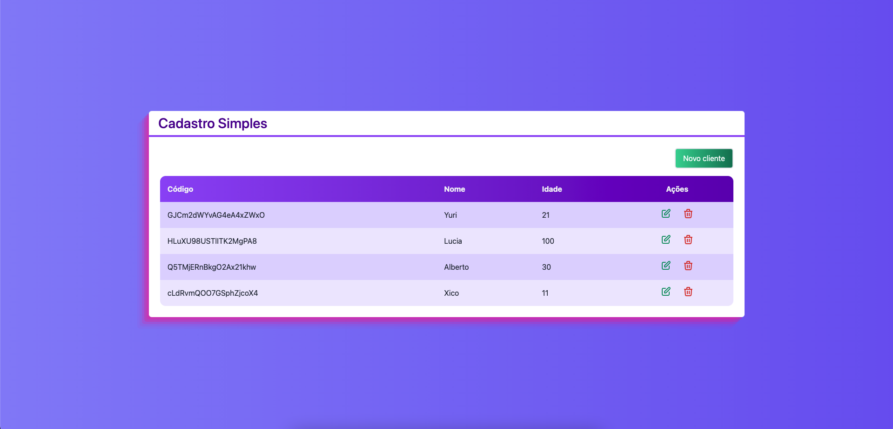

# Template Admin

Projeto Front-End feito em React - NextJS utilizando Typescript, TailWindCSS e Firebase na parte de autenticação de usuário.

# Como funciona?

Para instalar as dependências do Node utilize o comando no terminal da pasta:
```
npm i
```

Para rodar a aplicação React localmente, em modo de desenvolvimento, utilize o seguinte comando no terminal da pasta:
```
npm run dev
```

# Explicando o projeto

Este projeto trata-se de um CRUD simples integrado com o banco de dados do Firebase 




